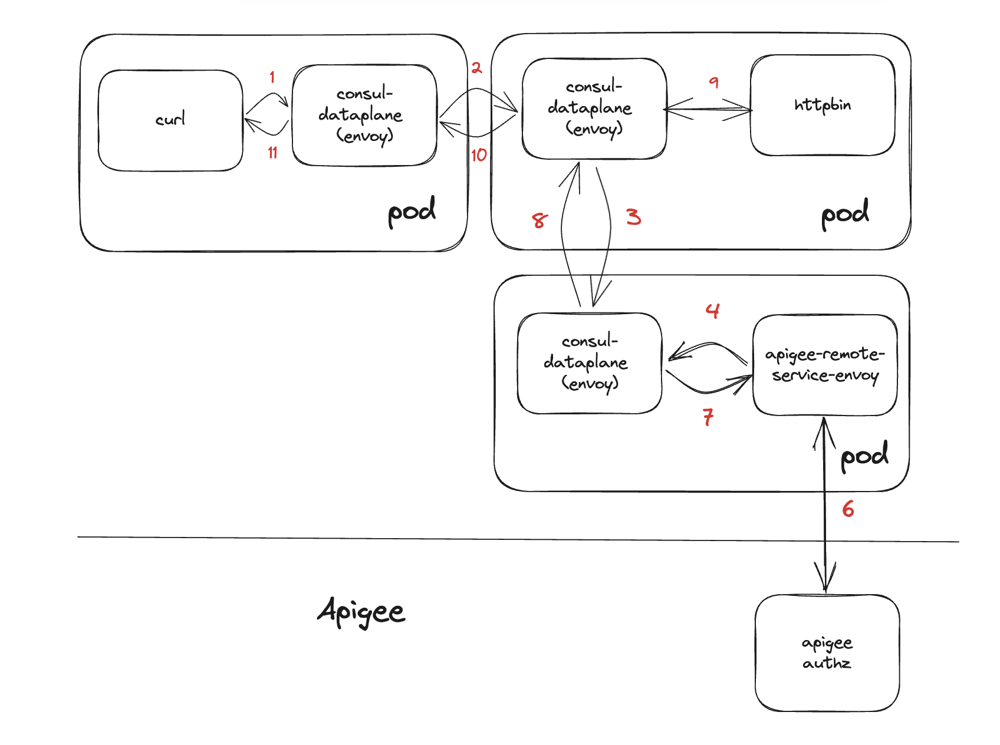

# consul-k8s-apigee-hybrid



## Apigee hybrid used for ext_authz with Consul Service Mesh

Following instructions are taken from the [quickstart repository here](https://github.com/apigee/devrel/tree/main/tools/hybrid-quickstart) please refer to this repo for issues and further assistance.

### Select a GCP project

* Select the GCP project to install Apigee hybrid

```sh
export PROJECT_ID=xxx
gcloud config set project $PROJECT_ID
gcloud auth login
gcloud auth application-default login
```

### (Optional) Override Default Config

* The following environment variables are set by default, export them to override the default values if needed.

```sh
# GCP region and zone for the runtime
export REGION='us-west1'
export ZONE='us-west1-a,us-west1-b,us-west1-c'

# Networking
export NETWORK='apigee-hybrid'
export SUBNET='apigee-us-west1'

# Runtime GKE cluster
export GKE_CLUSTER_NAME='apigee-hybrid'
export GKE_CLUSTER_MACHINE_TYPE='e2-standard-4'

# Apigee Env Config
export ENV_NAME='env'
export ENV_GROUP_NAME='envgroup'

# By default a subdomain will be created for every env group e.g. env.1-2-3-4.nip.io (where 1.2.3.4 is the IP of the istio ingress)
export DNS_NAME="my-ingress-ip.nip.io"

# Choose between 'external' and 'internal' ingress
export INGRESS_TYPE="external"
```

### Initialize the Apigee hybrid runtime on a GKE cluster

After the configuration is done run the following command to initialize you
Apigee hybrid organization and runtime. ***This typically takes between 15 and
20min.***

```sh
infra/initialize-runtime-gke.sh
```

* Apigee hybrid config files are generated at [infra/hybrid-files/overrides.yaml](infra/hybrid-files/overrides.yaml)

### Install Consul in k8s

* This example needs Consul version > 1.16 to work

```sh
export CONSUL_LICENSE="paste-your-consul-license-here"
kubectl create ns consul
kubectl create secret generic consul-enterprise-license --from-literal=key=$CONSUL_LICENSE -n consul
helm install consul hashicorp/consul --namespace consul --values consul/values.yaml
```

* (Optional) Alternatively use [consul-k8s](https://github.com/hashicorp/consul-k8s) cli service to install Consul

```sh
brew install consul-k8s # change based on the OS
kubectl create ns consul
consul-k8s install -namespace consul -f consul/values.yaml
```

* Ensure Consul services are healthy

```sh
kubectl get pods -n consul
```

### Configure Apigee Envoy adapter and deploy sample services

Following instructions are taken from [this guide](https://cloud.google.com/apigee/docs/api-platform/envoy-adapter/v2.0.x/example-hybrid) please refer there for issues and further assistance.

* Download the [apigee-remote-serice-cli](https://github.com/apigee/apigee-remote-service-cli)

```sh
curl -L https://github.com/apigee/apigee-remote-service-cli/releases/download/v2.1.1/apigee-remote-service-cli_2.1.1_macOS_64-bit.tar.gz > apigee-remote-service-cli.tar.gz
tar -xf apigee-remote-service-cli.tar.gz
rm apigee-remote-service-cli.tar.gz
./apigee-remote-service-cli -h
```

* Configure upstream Apigee authorization service

```sh
export PROJECT_ID=xxx
gcloud config set project $PROJECT_ID
gcloud auth login
gcloud auth application-default login
export TOKEN=$(gcloud auth print-access-token);echo $TOKEN

# k8s namespace where the services will be created
export NAMESPACE="apigee"
export ORG="paste_your_GCP_org_id"
export ENV="env"
export RUNTIME="https://envgroup.paste_the_generated.nip.io"

# Provision the services in Apigee
./apigee-remote-service-cli provision --organization $ORG --environment $ENV --runtime $RUNTIME --namespace $NAMESPACE --token $TOKEN --insecure --verbose > config.yaml
```

* Apply the generated config for Apigee and sample services

```sh
# generate the configmap, secret and service account in apigee namespace
kubectl apply -f config.yaml

# generate the configmap, secret and service account in default namespace
yq eval 'select(.metadata.namespace == "apigee") | .metadata.namespace = "default"' -i "config.yaml"
kubectl apply -f config.yaml

# configure apigee-envoy-adapter deployment yaml
export SECRET_NAME="${ORG}-${ENV}-policy-secret"
yq eval '.spec.template.spec.volumes[1].secret.secretName = env(SECRET_NAME)' -i apigee/apigee-envoy-adapter.yaml
yq eval '.spec.template.metadata.labels.org = env(ORG)' -i apigee/apigee-envoy-adapter.yaml
yq eval '.spec.template.metadata.labels.env = env(ENV)' -i apigee/apigee-envoy-adapter.yaml

# configure apigee-envoy-adapter service yaml
yq eval '.metadata.labels.org = env(ORG)' -i apigee/apigee-envoy-adapter-svc.yaml
yq eval '.metadata.labels.env = env(ENV)' -i apigee/apigee-envoy-adapter-svc.yaml

# Deploy the proxy and it's service in K8s
kubectl apply -f apigee/

# Configure the apigee-envoy-adapter service as grpc in Consul using Service Default
kubectl apply -f consul/proxy_service_default.yaml

# Create consul intentions as such curl -> httpbin & httpbin -> apigee-envoy-adapter
kubectl apply -f consul/intentions.yaml

# Deploy the 2 services
kubectl apply -f app/
```

* Ping the httpbin service from curl service

```sh
kubectl exec -it deployment/curl -- /bin/sh
curl -i httpbin.default.svc.cluster.local/headers
```

* The response should be HTTP/1.1 200 OK

```sh
HTTP/1.1 200 OK
server: envoy
date: Thu, 99 XX 20XX XX:XX:XX GMT
content-type: application/json
content-length: 2225
access-control-allow-origin: *
access-control-allow-credentials: true
x-envoy-upstream-service-time: 28

{
    "headers": {
        "Accept": "*/*", 
        "Host": "httpbin.default.svc.cluster.local", 
        "User-Agent": "curl/8.2.0", 
        "X-Envoy-Auth-Failure-Mode-Allowed": "true", 
        "X-Envoy-Expected-Rq-Timeout-Ms": "15000", 
        "X-Forwarded-Client-Cert": "--cert-redacted--"
    }
}
```

### Apply the ext_authz filter

* The ext_authz filter will be applied on the httpbin

```sh
kubectl apply -f consul/ext_authz.yaml
```

* (Optional) To debug port forward and visit [localhost:19000](localhost:19000) > click config_dump > search for 'ext_authz'

```sh
kubectl port-forward deployment/httpbin 19000
```

* Ping the httpbin service from curl service again

```sh
kubectl exec -it deployment/curl -- /bin/sh
curl -i httpbin.default.svc.cluster.local/headers
```

* The response should be HTTP/1.1 403 Forbidden

```sh
HTTP/1.1 403 Forbidden
date: Thu, 99 XX 20XX XX:XX:XX GMT
server: envoy
content-length: 0
x-envoy-upstream-service-time: 3
```

* After using the API key generated from Apigee [(follow guide here)](https://cloud.google.com/apigee/docs/api-platform/envoy-adapter/v2.0.x/operation#how-to-obtain-an-api-key) and pinging again the response should have Apigee headers

> **_NOTE:_** There might be a delay after creating the API key of ~2 mins. 

```sh
curl -i httpbin.default.svc.cluster.local/headers -H "x-api-key: developer_client_key_goes_here"
```

```sh
HTTP/1.1 200 OK
server: envoy
date: Thu, 99 XX 20XX XX:XX:XX GMT
content-type: application/json
content-length: 2727
access-control-allow-origin: *
access-control-allow-credentials: true
x-envoy-upstream-service-time: 22
{
    "headers": {
        "Accept": "*/*", 
        "Host": "httpbin.default.svc.cluster.local", 
        "User-Agent": "curl/8.2.0", 
        "X-Api-Key": "developer_client_key_goes_here", 
        "X-Apigee-Accesstoken": "", 
        "X-Apigee-Api": "httpbin.default.svc.cluster.local", 
        "X-Apigee-Apiproducts": "httpbin-product", 
        "X-Apigee-Application": "httpbin-app", 
        "X-Apigee-Authorized": "true", 
        "X-Apigee-Clientid": "developer_client_key_goes_here", 
        "X-Apigee-Developeremail": "user@hashicorp.com", 
        "X-Apigee-Environment": "env", 
        "X-Apigee-Organization": "GCP_ORG_ID", 
        "X-Apigee-Scope": "", 
        "X-Envoy-Expected-Rq-Timeout-Ms": "15000",
        "X-Forwarded-Client-Cert": "--cert-redacted--"
    }
}
```

### Clean up

This tool includes a script to automatically clean up the Apigee hybrid
runtime resources (without deleting the Apigee Organization).

```sh
infra/destroy-runtime-gke.sh
```
